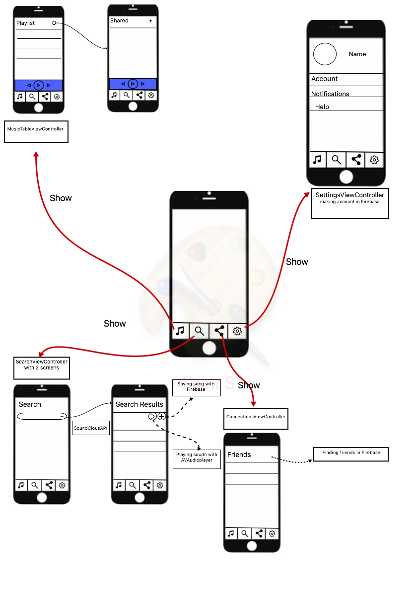

# Design Document

## Files

### Classes
MusicTableViewController
SettingsViewController
SearchViewController
ConnectionsViewController
ConnectionsViewController
MusicItem:
- name
- artist 
- album
- year
- ID

### Functions
-	updateUI()
-	tableView()
- playing music
-	prepare for next screen
- displaying list of music
- making a playlist/ saving songs
- displaying friends
- making a account
- share a playlist

## Firebase
- Name
- ID
- Playlist

## Design

