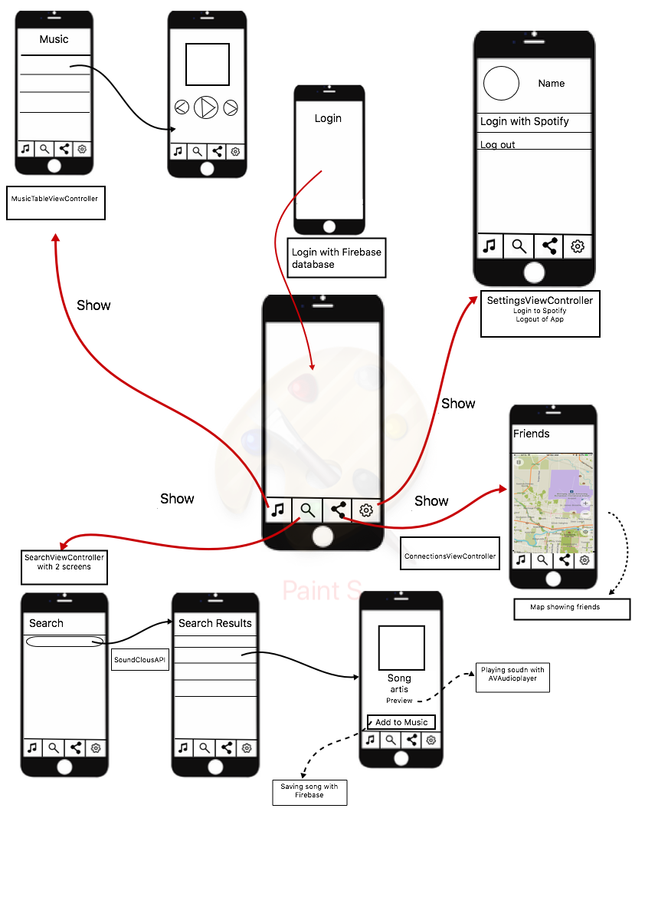

# README.md

## Problem
You are at a party or just hanging with friends where there is music playing. However not everybody likes the music or some songs. 
It would have been great if you could create playlists with different friends, so when you're together, you will always enjoy the
music!

These problems occur to people of all ages and interest but mostly to people that love music.

## Solution
This app is new and fun way to share music. You can search the song, listen to the preview to make sure it is the rigt one and add it to 
a playlist. Through the map you can search the locations of your friends and look at their profile. Make playlists together for every
occation.

Make playlists, spot friends and share!

## Prerequisites
To stream and search music the Spotify API is used. For saving the songs and creating an account for the app Firebase is used. 

## Design

## Instructions

To use the app, you need a Spotify account! When opening the app you will be directed to login or create an account for the app. After 
this you will be directed to the music screen. Go to setting to login to Spotify by clicking on the button. After login you can search and 
play music on the app. Lookup other users locations by going to the friends screen.
